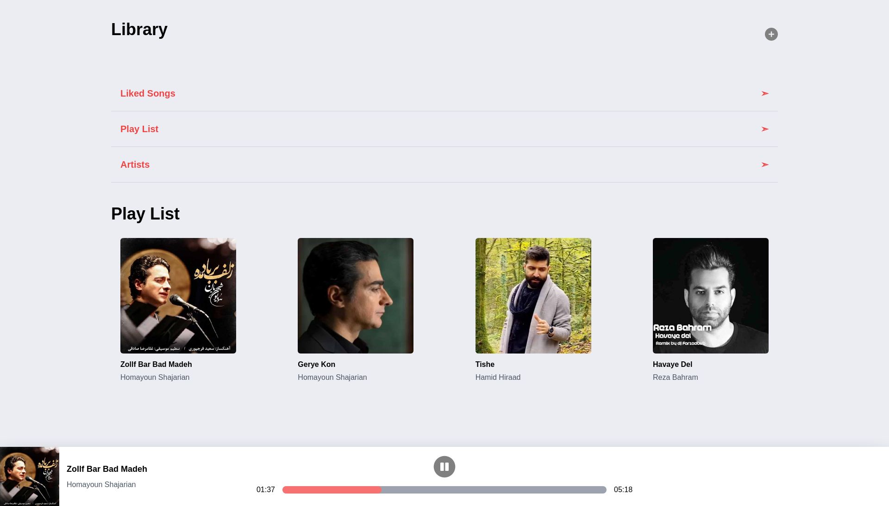

# MongoDB Reactjs Nodejs Expressjs Player

A M.E.R.N  SPA Player

 
 

- [x] React 18.0.0
- [x] TailwindCSS v3.0.23
- [x] Restful API
- [x] MongoDB
- [x] Nodejs
- [x] Expressjs
- [x] Latest Webpack , Babel 7 and Webpack Dev Server ,with Scope Hoisting enabled
- [x] ES6 linting with continuous linting on file change
- [x] Separate CSS stylesheets generation
- [x] Automatic HTML generation

## Starting the dev server

Make sure you have the latest Stable or LTS version of Node.js installed.

1. `git clone https://github.com/am-abazari/Mern-Player/tree/main/frontend.git`
2. cd `backend`
3. Run `npm install` or `nodemon app.js`
4. Start the dev server using `npm start`
5. cd `../frontend`
6. Run `npm install` or `yarn install`
7. Start the dev server using `npm start`

## Available Commands

- `npm start` - start the dev server
- `npm clean` - delete the dist folder
- `npm run build` - create a optimized build in `build` folder

## Code Coverage

The project is using the <strong>MongoDB Reactjs Nodejs Expressjs</strong>. All configurations are located in `frontend/package.json & backend/package.json`

The coverage report consists of an HTML reporter, which can be viewed in the browser and some helper coverage files like the coverage json file.

## About Author

<strong>Amirhossein Abazari</strong> Full-Stack Web Developer
